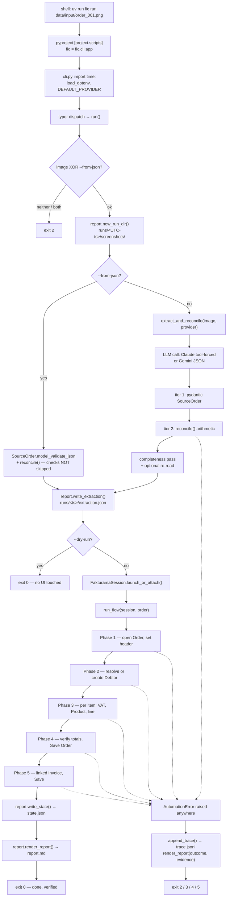
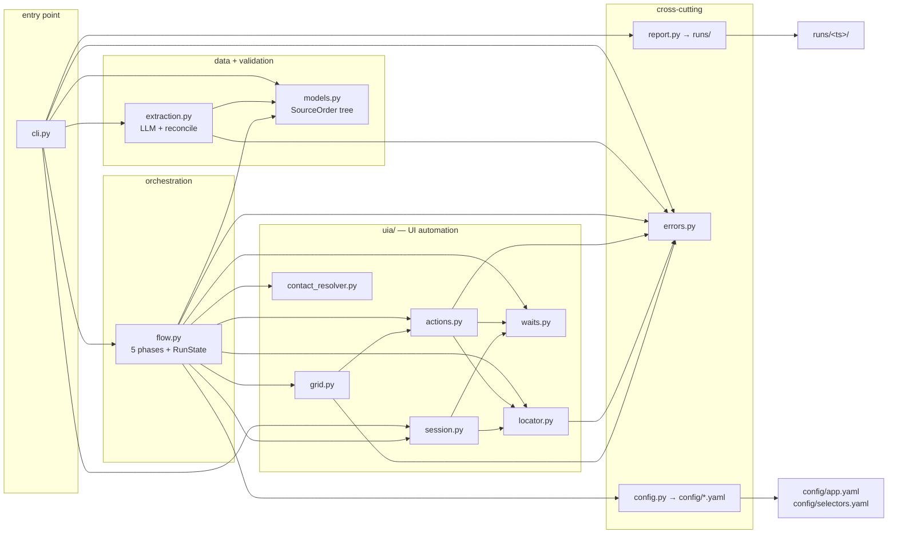
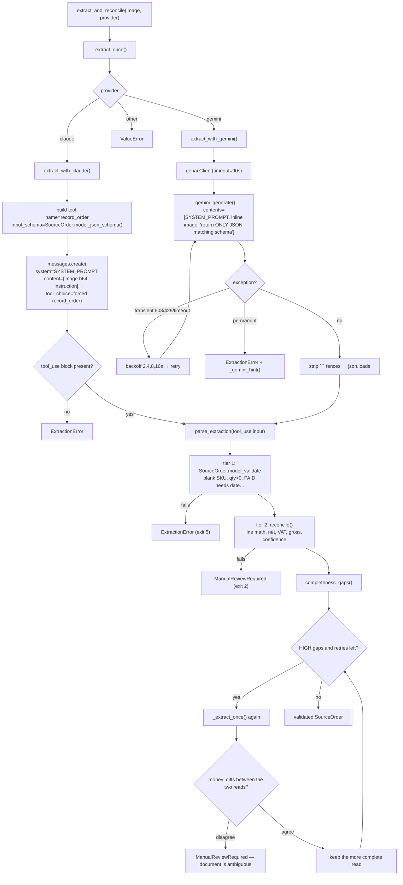
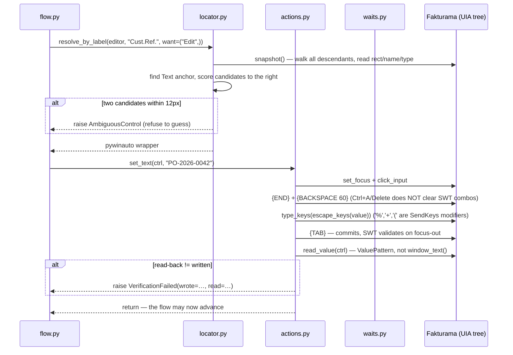
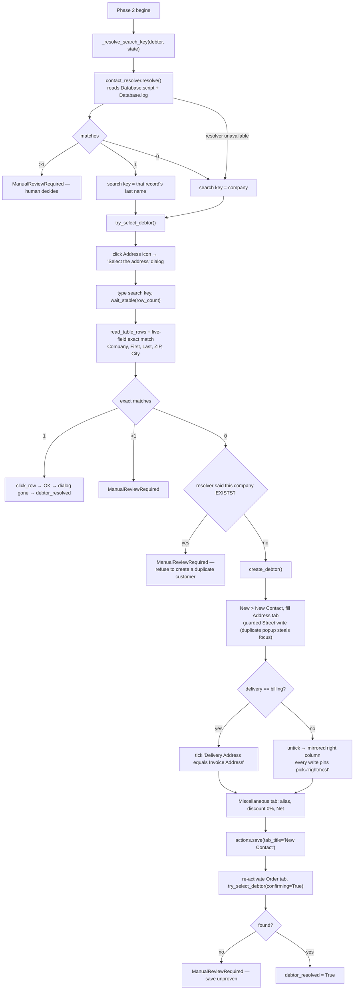
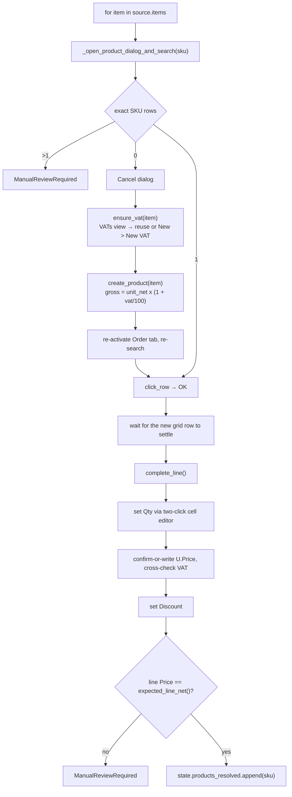
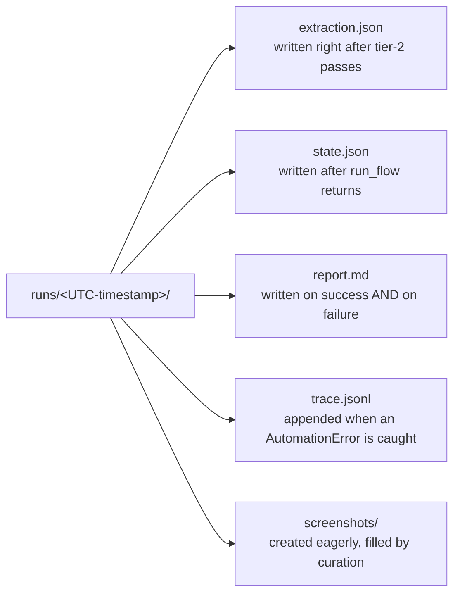

# ARCHITECTURE — the code, end to end

An exhaustive, code-level map of this project: what executes from the moment you press
Enter on the command line, how the LLM is called and what contract it must satisfy,
where every produced artifact is stored, how the UI automation layer is built, why the
folders are split the way they are, and exactly how each module talks to every other
module.

This document is the *mechanical* reference. Its siblings:

| Document | Answers |
|---|---|
| [HOW_TO_RUN.md](HOW_TO_RUN.md) | How do I operate it? |
| [HOW_IT_WORKS.md](HOW_IT_WORKS.md) | Narrative walkthrough of one run |
| [README.md](README.md) | *Why* the code is shaped this way — every bug found against the real app |
| **ARCHITECTURE.md** (this file) | The full call graph, contracts, storage, and folder rationale |

Every claim below is anchored to a file and line so you can read the code beside it.

---

## Table of contents

1. [Flow charts](#1-flow-charts)
2. [Stage 0 — process start](#2-stage-0--process-start-clipy)
3. [Stage 1 — the LLM stage](#3-stage-1--the-llm-stage-extractionpy)
4. [Stage 2 — where the output is stored](#4-stage-2--where-the-output-is-stored-reportpy)
5. [Stage 3 — the automation layer](#5-stage-3--the-automation-layer-uia)
6. [Stage 4 — the five phases of `flow.py`](#6-stage-4--the-five-phases-of-flowpy)
7. [Folder layout and why it is split this way](#7-folder-layout-and-why-it-is-split-this-way)
8. [How the modules talk to each other](#8-how-the-modules-talk-to-each-other)
9. [Error taxonomy and exit codes](#9-error-taxonomy-and-exit-codes)
10. [A real annotated run](#10-a-real-annotated-run)

---

## 1. Flow charts

### 1.1 Master flow — one complete `fic run <image>`



### 1.2 Module dependency graph — who imports whom



Two properties fall out of this graph and are worth naming because they are enforced,
not accidental:

- **`models.py` and `errors.py` are leaves.** They import nothing from the project.
  Everything else may depend on them, so the data shape and the failure vocabulary are
  the two things every layer agrees on.
- **`uia/` never imports `flow.py` or `extraction.py`.** The automation layer knows
  nothing about orders, VAT, or LLMs. It only knows controls, waits, and read-backs.
  The direction of dependency is one-way, which is what makes `uia/` testable and
  reusable against any Fakturama screen.

### 1.3 The LLM stage in detail



### 1.4 One verified write — the primitive every UI step is built on



### 1.5 Debtor resolution — the most branch-heavy phase



### 1.6 Product line resolution



### 1.7 Artifacts produced by one run



---

## 2. Stage 0 — process start (`cli.py`)

### 2.1 How the name `fic` becomes Python

[pyproject.toml:26-27](pyproject.toml#L26-L27) declares the console script:

```toml
[project.scripts]
fic = "fic.cli:app"
```

`uv run fic …` resolves the locked environment from `uv.lock`, then calls the `app`
object in [src/fic/cli.py](src/fic/cli.py). `app` is a `typer.Typer` instance
([cli.py:19](src/fic/cli.py#L19)), so typer does the argument parsing and dispatch.

There is a second, equivalent door: [src/fic/__main__.py](src/fic/__main__.py) imports
the same `app`, so `python -m fic` works identically. One entry object, two ways in —
no duplicated argument handling.

### 2.2 What happens at import, before any command runs

Three things execute at module import time, and their order matters
([cli.py:12-20](src/fic/cli.py#L12-L20)):

1. `load_dotenv()` — `.env` is loaded into `os.environ` **before** anything reads it.
2. `DEFAULT_PROVIDER = os.environ.get("FIC_PROVIDER", "gemini")` — the provider default
   is read *after* `load_dotenv()`, which is why `.env` can override the built-in
   default. Reversing those two lines would silently make `.env` inert.
3. `app` and a `rich.Console` are constructed.

Heavy dependencies are **not** imported here. `anthropic`, `google.genai`, and every
`pywinauto` import is deferred into the function that needs it
([cli.py:30](src/fic/cli.py#L30), [cli.py:82-87](src/fic/cli.py#L82-L87),
[extraction.py:123](src/fic/extraction.py#L123),
[session.py:56](src/fic/uia/session.py#L56)). Consequences:

- `fic --help` works with no API SDK installed and on non-Windows machines.
- `fic extract` never loads `pywinauto`; `fic probe` never loads an LLM SDK.
- Import cost is paid only by the code path that needs it.

### 2.3 The three commands

| Command | Defined at | Touches the LLM? | Touches the UI? |
|---|---|---|---|
| `fic extract IMAGE` | [cli.py:23-38](src/fic/cli.py#L23-L38) | yes | no |
| `fic probe` | [cli.py:41-55](src/fic/cli.py#L41-L55) | no | reads only — dumps the live UIA tree |
| `fic run [IMAGE]` | [cli.py:58-148](src/fic/cli.py#L58-L148) | yes (unless `--from-json`) | yes (unless `--dry-run`) |

`fic probe` deserves a note: it is the calibration tool. It attaches to a running
Fakturama and prints every control's type, name, rectangle and enabled state via
`locator.snapshot()`. Every "live-confirmed" comment in this codebase was produced by
reading that output rather than guessing at the accessibility tree.

### 2.4 `run()` step by step

```python
run_dir = new_run_dir()                      # cli.py:96  — created BEFORE anything can fail
state = RunState()                           # cli.py:100 — empty, but in scope for except
```

The ordering here is deliberate and is the thing that makes failures legible:

- **The run directory is created first** ([cli.py:96](src/fic/cli.py#L96)), so a crash at
  any later point still has somewhere to write its report.
- **`state` is constructed before the `try`** ([cli.py:100](src/fic/cli.py#L100)) so the
  `except` blocks can render whatever log entries exist. If `state` were created inside
  `run_flow`, a mid-flow failure would render an empty report.

Argument validation ([cli.py:89-94](src/fic/cli.py#L89-L94)) enforces exactly one
source: an `IMAGE` **or** `--from-json`, never neither and never both.

`--from-json` replaces only the model call. The JSON is validated through
`SourceOrder.model_validate_json` and then passed through the same `reconcile()` gate
([cli.py:106-107](src/fic/cli.py#L106-L107)). It skips the LLM, not the checks.

Then the exception funnel ([cli.py:128-148](src/fic/cli.py#L128-L148)), in order:

1. `except typer.Exit: raise` — typer signals normal exit *by raising*. Without this
   re-raise first, a successful `--dry-run` or a completed run would be caught by the
   generic handler below and reported as "unexpected error" with a traceback.
2. `except AutomationError` — appends the structured evidence to `trace.jsonl`, renders
   `report.md` with the error, prints the message and evidence, and exits with the
   exception's own `exit_code`.
3. `except Exception` — renders a report with the full traceback and exits 1.

Every path through `run()` therefore leaves a written report on disk.

---

## 3. Stage 1 — the LLM stage (`extraction.py`)

### 3.1 The core idea

The model is never asked for prose. It is asked to produce **data matching a schema
that was generated from the code's own type definitions**:

```python
def _order_schema() -> dict:
    return SourceOrder.model_json_schema()      # extraction.py:92-94
```

That single line is the contract between the model and the rest of the program. The
prompt does not describe the fields in English and hope; the schema is derived from
[models.py](src/fic/models.py), so adding a field to `SourceOrder` automatically changes
what the model is asked for, and the validator that checks the answer is the same class
that generated the question.

### 3.2 The prompt

`SYSTEM_PROMPT` ([extraction.py:66-89](src/fic/extraction.py#L66-L89)) is shared by both
providers. Its rules exist to prevent specific failure modes:

| Rule | Prevents |
|---|---|
| "Transcribe verbatim. Never infer, complete, guess, or correct." | A model tidying a total into something plausible |
| Money as plain decimal strings, no symbols/separators | Locale ambiguity in `Decimal(...)` |
| Percentages numeric only | `"19%"` failing to parse |
| ISO 8601 dates | Day/month ambiguity |
| Both addresses always extracted separately, even when identical | The model collapsing delivery into billing and destroying a real difference |
| `paid_status` exactly `PAID`/`UNPAID`, otherwise flag low confidence | Silently marking a partially-paid order as paid |
| Omit genuinely absent optional fields rather than inventing | Fabricated data entering a financial record |
| Report per-field confidence for money/date/percentage | Gives `reconcile()` a halt signal it can act on |

### 3.3 The Claude path — a forced tool call

[extract_with_claude()](src/fic/extraction.py#L119-L155):

```python
resp = client.messages.create(
    model=model or DEFAULT_MODEL,               # FIC_CLAUDE_MODEL, default claude-opus-5
    max_tokens=8000,
    system=SYSTEM_PROMPT,
    tools=[{"name": "record_order",
            "input_schema": SourceOrder.model_json_schema()}],
    tool_choice={"type": "tool", "name": "record_order"},   # FORCED
    messages=[{"role": "user", "content": [image_block, instruction_text]}],
)
```

Three details:

- **`tool_choice` forces the tool.** The model cannot answer in prose; the only shape it
  can emit is a `record_order` call whose input matches the schema. That removes an
  entire class of parsing work.
- **The image is a base64 block** built by `_image_block()`
  ([extraction.py:105-117](src/fic/extraction.py#L105-L117)), which maps the file suffix
  to a media type (`png`/`jpeg`/`webp`, defaulting to png).
- **A missing `tool_use` block is an `ExtractionError`**
  ([extraction.py:150-154](src/fic/extraction.py#L150-L154)) carrying the raw response as
  evidence — not a crash, and not a silent empty result.

There is no separate OCR stage. Vision reads the image directly.

### 3.4 The Gemini path — JSON with the schema inlined

Gemini has no forced-tool equivalent here, so the schema is inlined into the request
([extraction.py:280-292](src/fic/extraction.py#L280-L292)):

```python
contents=[
    {"text": SYSTEM_PROMPT},
    {"inline_data": {"mime_type": media_type, "data": image_bytes}},
    {"text": "Return ONLY a JSON object matching this schema "
             "(no prose, no markdown fences):\n" + json.dumps(_order_schema())},
]
```

Then the response is defended against three real behaviours:

1. **Markdown fences.** Models wrap JSON in ``` despite instructions, so fences are
   stripped before `json.loads` ([extraction.py:207-212](src/fic/extraction.py#L207-L212)).
2. **No timeout by default.** The SDK's default is *wait forever*, so a stalled request
   never raises and the retry logic never fires — the run just sits there printing
   nothing. An explicit `HttpOptions(timeout=…)` turns a hang into an ordinary transient
   failure ([extraction.py:186-188](src/fic/extraction.py#L186-L188), 90s default via
   `FIC_GEMINI_TIMEOUT`).
3. **Model aliases, not pins.** `DEFAULT_GEMINI_MODEL = "gemini-flash-latest"`
   ([extraction.py:170](src/fic/extraction.py#L170)) — a pinned `gemini-2.5-pro` had
   already been retired and failed with a 404 that looked like a config error.

### 3.5 Retry policy — what is worth retrying and what is not

`_is_transient()` ([extraction.py:237-257](src/fic/extraction.py#L237-L257)) draws the
line precisely:

- **Retryable:** 503/UNAVAILABLE, 429/RESOURCE_EXHAUSTED, timeouts, dropped connections.
  In all of these the request never received a verdict, so re-sending is not "hoping for
  a different answer to the same question".
- **Not retryable:** bad key, retired model, malformed image. These fail identically
  forever; retrying only delays the real message.

`_gemini_generate()` ([extraction.py:260-309](src/fic/extraction.py#L260-L309)) sleeps
2s, 4s, 8s, 16s between attempts and prints a line per attempt so a slow run reads as
progress. `_gemini_hint()` ([extraction.py:312-336](src/fic/extraction.py#L312-L336))
turns each of the three failures actually hit during development into one actionable
sentence instead of a 60-line SDK traceback.

### 3.6 Tier 1 — structural validation

`parse_extraction()` ([extraction.py:339-348](src/fic/extraction.py#L339-L348)) runs
`SourceOrder.model_validate(data)` and converts a `ValidationError` into an
`ExtractionError` carrying `pydantic_errors`. The validators live in
[models.py](src/fic/models.py) and each one encodes a specific corner case:

| Validator | Location | Rejects |
|---|---|---|
| address fields not blank | [models.py:41-47](src/fic/models.py#L41-L47) | an empty street/city/zip |
| company not blank | [models.py:61-67](src/fic/models.py#L61-L67) | a nameless debtor |
| `paid_requires_date` | [models.py:100-108](src/fic/models.py#L100-L108) | `PAID` with no date — a contradiction the brief forbids resolving by guessing |
| sku / description not blank | [models.py:122-136](src/fic/models.py#L122-L136) | an unidentifiable line |
| `qty_positive` | [models.py:138-143](src/fic/models.py#L138-L143) | quantity ≤ 0 |
| `price_not_negative` | [models.py:145-151](src/fic/models.py#L145-L151) | negative price (zero is a legitimate free line) |
| `discount_in_range` | [models.py:153-158](src/fic/models.py#L153-L158) | a discount outside 0–100 |
| `items` min_length=1 | [models.py:213](src/fic/models.py#L213) | an order with no lines |

Money is `Decimal` end to end, never `float`, and `q2()`
([models.py:28-31](src/fic/models.py#L28-L31)) is the single rounding rule
(`ROUND_HALF_UP`, 2 places) used everywhere, so every computed value is reproducible.

Two helpers on `SourceItem` are load-bearing and easy to overlook:

- `vat_pct_str()` ([models.py:177-195](src/fic/models.py#L177-L195)) — `str(Decimal("20")
  .normalize())` yields `'2E+1'`, which Fakturama parses as **0**, silently creating a
  0% tax rate named "VAT 20%". `format(x, "f")` is the fix.
- `product_master_gross()` ([models.py:172-175](src/fic/models.py#L172-L175)) — the
  product master's price grosses up by VAT only and deliberately ignores the *line's*
  discount, which belongs to the transaction, not the catalogue.

### 3.7 Tier 2 — cross-field arithmetic (`reconcile`)

[reconcile()](src/fic/extraction.py#L351-L428) checks what a per-field type cannot,
within `TOLERANCE = Decimal("0.02")`:

```
per line     quantity × unit_net × (1 − discount/100)      == line_net_total
order net    Σ lines − order discount + shipping           == net_total
VAT          Σ (line net × (1 − order discount) × vat%)    == vat_total
             + shipping × the single line rate, if unambiguous
gross        net_total + vat_total                         == gross_total
confidence   every reported score                          >= 0.80
```

Two subtleties:

- **Shipping is modelled explicitly.** An earlier version compared the bare sum of line
  totals against `net_total`, which silently assumed shipping and order discount were
  always zero — true of the sample document, false for any order that charges shipping.
- **Shipping VAT is inferred only when unambiguous.** If every line shares one rate, that
  rate applies to shipping too; if the order mixes rates, `reconcile` says so and stops
  rather than picking one ([extraction.py:401-410](src/fic/extraction.py#L401-L410)).

Any failure raises `ManualReviewRequired` with the full list of issues. **Nothing is
ever auto-corrected** — a wrong number quietly adjusted to a plausible one is the worst
possible outcome for a system that writes financial records.

### 3.8 Tier 3 — completeness, and the second reading

`completeness_gaps()` ([extraction.py:547-584](src/fic/extraction.py#L547-L584)) catches
what tiers 1 and 2 structurally cannot: an extraction that is *valid* and *arithmetically
consistent* but has quietly dropped a field the automation depends on.

The motivating incident is recorded in the docstring: a model swap returned
`first_name=None, last_name=None` for a debtor another model read as "Elena Richter" —
while still returning her email. Nothing complained, and the damage surfaced much later
as an unmatchable debtor and a duplicate contact.

- **HIGH** = it changes what the automation *does*. Currently: no first name **and** no
  last name — the five-field debtor match cannot work without them.
- **LOW** = informational (no confidence scores, missing email/phone/customer-id hint, a
  line with no unit).

On a HIGH gap, `extract_and_reconcile()`
([extraction.py:431-506](src/fic/extraction.py#L431-L506)) re-reads the image
(`FIC_EXTRACT_RETRIES`, default 1). Then the crucial guard: the two readings are compared
by `money_diffs()` ([extraction.py:520-541](src/fic/extraction.py#L520-L541)).

- If they **disagree** on any money-bearing field → `ManualReviewRequired`. Two attempts
  reading one document differently is exactly the case a human must settle.
- If they **agree** → the more complete reading wins.

A still-incomplete extraction prints a loud warning but proceeds by default, because a
company-only order genuinely has no contact person. `FIC_EXTRACT_STRICT=1` turns it into
a halt.

### 3.9 The optional two-provider cross-check

`self_consistency_check()` ([extraction.py:587-620](src/fic/extraction.py#L587-L620)),
reached via `fic run --cross-check`, extracts with **both** Claude and Gemini and diffs
`net_total`, `vat_total`, `gross_total`, item count, per-item SKU and per-item line
total. Disagreement is a designed halt: two different models disagreeing means the source
image is probably genuinely ambiguous, not just noisy. On agreement it returns the Claude
extraction.

---

## 4. Stage 2 — where the output is stored (`report.py`)

Everything a run produces lands in **one timestamped directory**, and nothing is written
outside it. [report.py:12-20](src/fic/report.py#L12-L20):

```python
REPO_ROOT = Path(__file__).resolve().parents[2]   # …/fakturama-image-to-cash
RUNS_DIR  = REPO_ROOT / "runs"

def new_run_dir() -> Path:
    ts = datetime.now(timezone.utc).strftime("%Y-%m-%dT%H-%M-%S")
    run_dir = RUNS_DIR / ts
    (run_dir / "screenshots").mkdir(parents=True, exist_ok=True)
    return run_dir
```

`REPO_ROOT` is derived from `__file__`, so the location is correct regardless of the
working directory you invoke from. The timestamp is **UTC** and uses `-` instead of `:`
because `:` is illegal in a Windows path. Sorting the directory alphabetically therefore
sorts it chronologically.

### 4.1 The four artifacts

| File | Written by | Written when | Contents |
|---|---|---|---|
| `extraction.json` | `write_extraction()` [report.py:23-27](src/fic/report.py#L23-L27) | immediately after tier 2 passes, **before** any UI is touched | `order.model_dump_json(indent=2)` — the exact validated `SourceOrder` |
| `state.json` | `write_state()` [report.py:29-32](src/fic/report.py#L29-L32) | after `run_flow` returns successfully | `asdict(RunState)` — order number, what was reused vs created, full log, resolver matches |
| `trace.jsonl` | `append_trace()` [report.py:35-38](src/fic/report.py#L35-L38) | on a caught `AutomationError` | one JSON object per line, each stamped with a UTC ISO timestamp |
| `report.md` | `render_report()` [report.py:41-62](src/fic/report.py#L41-L62) | on success **and** on every failure | outcome line, error block if any, the log as bullets, embedded screenshots |
| `screenshots/` | `new_run_dir()` | at run start | created eagerly; `render_report` globs `*.png` and embeds whatever is there |

`extraction.json` is written **before** the UI stage on purpose
([cli.py:114](src/fic/cli.py#L114)). The expensive, non-deterministic, paid part of the
pipeline is persisted the moment it succeeds, which is what makes
`fic run --from-json runs/<ts>/extraction.json` a real recovery path: re-run the
automation deterministically without paying for extraction again.

`append_trace` uses JSON **Lines** rather than a JSON array so it can be appended to
without rewriting the file, and stays readable even if the process dies mid-write.
`json.dumps(..., default=str)` is what lets `Decimal`, `date` and `Path` values serialize
without a custom encoder.

`render_report` reads `getattr(state, "log", [])` defensively — it is called from the
`except` blocks with a `RunState` that may never have been populated, and must not fail
while reporting a failure.

### 4.2 What is deliberately *not* stored

- **No screenshots are captured automatically.** The directory is created and the report
  embeds whatever is placed there; capture is a curation step, not an automatic one.
- **No database writes by this project.** Everything that persists in Fakturama gets
  there through its own UI. The only direct DB access is *read-only*
  ([contact_resolver.py](src/fic/uia/contact_resolver.py)) and is advisory.
- **No credentials.** `.env` is git-ignored; `.env.example` documents the keys.

---

## 5. Stage 3 — the automation layer (`uia/`)

The automation is split into five modules with strictly separated jobs. The split is the
architecture: each module answers exactly one question.

| Module | The one question it answers |
|---|---|
| [session.py](src/fic/uia/session.py) | *Which window am I driving, and is it ready?* |
| [locator.py](src/fic/uia/locator.py) | *Which control is this, in the live tree, right now?* |
| [actions.py](src/fic/uia/actions.py) | *Did my write actually land?* |
| [waits.py](src/fic/uia/waits.py) | *Has the UI settled?* |
| [grid.py](src/fic/uia/grid.py) | *How do I edit a cell in the Items table?* |
| [contact_resolver.py](src/fic/uia/contact_resolver.py) | *What should I type into the search box?* |

### 5.1 `session.py` — attach, and prove readiness

`launch_or_attach()` ([session.py:55-132](src/fic/uia/session.py#L55-L132)) tries
`Application(backend="uia").connect(path=…)` first and only starts a new process if that
fails — attaching to an already-open Fakturama is instant, while a cold Eclipse RCP start
takes 1–2 minutes.

The important part is that **"which window?" and "is it ready?" are the same question**:

```python
def _ready_window():
    for win in self._candidate_windows():          # EVERY title match, not the first
        try:
            find_by_name(win, "Create: New Order", control_type="Button")
        except Exception:
            continue
        return win                                  # the window that HAS the toolbar
```

During startup a splash window also matches on title. An earlier version bound
`main_window` once and then polled *that fixed reference* for a toolbar — so it latched
onto the splash and waited the full timeout for a toolbar that would never appear, while
the real window opened unnoticed beside it. The failure was silent by construction, since
the lookup was returning "not yet", not raising.

A heartbeat prints every 15 seconds so a slow start reads as progress rather than a hang.

`wait_for_any_tab(*titles)` ([session.py:203-226](src/fic/uia/session.py#L203-L226))
polls **all** candidate titles inside one shared timeout budget, rather than burning a
full timeout on each candidate in sequence. It also clicks the tab it finds, which is how
the flow re-activates the Order tab after a detour.

`close()` deliberately does **not** kill Fakturama — the operator's session and any
unsaved manual work must not be torn down by the automation exiting.

**Known limitation, documented in the code** ([session.py:166-181](src/fic/uia/session.py#L166-L181)):
a `TabItem` element does not contain its tab's content fields as descendants in this UIA
tree, so field resolution is scoped to the whole main window. That is safe while only one
editor tab is open at a time (the only case this flow creates); with several open,
label-anchored resolution would see duplicate labels and correctly refuse as ambiguous
rather than silently guess.

### 5.2 `locator.py` — the grounding engine

**No coordinates are ever written down.** Every position used in a click is computed from
the tree at the moment of the call. `snapshot()`
([locator.py:37-56](src/fic/uia/locator.py#L37-L56)) flattens a container's descendants
into `Node(control_type, name, rect, enabled, wrapper)` records, swallowing per-element
errors so one stale element cannot fail the whole walk.

| Strategy | Function | Used for |
|---|---|---|
| S0 — name + type | `find_by_name` [:73](src/fic/uia/locator.py#L73) | toolbar buttons, `OK`/`Cancel`, named checkboxes |
| S1 — label-anchored spatial | `resolve_by_label` [:122](src/fic/uia/locator.py#L122) | most form fields |
| paired label | `resolve_pair_by_label` [:231](src/fic/uia/locator.py#L231) | `"First Name Last Name"`, `"ZIP, City"` — one label over two Edits |
| anchored icon | `resolve_anchored_icon` [:190](src/fic/uia/locator.py#L190) | the Address / Items icon pairs ("upper icon, not the green +") |
| rect-anchored | `find_nearest_right` [:264](src/fic/uia/locator.py#L264) | controls with no label at all, e.g. the price-mode combo right of `Date` |
| grid discovery | `find_grid` [:290](src/fic/uia/locator.py#L290) | dialogs and list views, disambiguated by `required_headers` |
| row reading | `read_table_rows` [:386](src/fic/uia/locator.py#L386) | search results, keyed left-to-right by declared columns |

Three properties do the real work:

**Ambiguity refusal.** `resolve_by_label` scores candidates by distance from the label
anchor; if the two closest are within `ambiguity_margin_px` (12, from
[config/app.yaml](config/app.yaml)) of each other, it raises `AmbiguousControl` instead of
picking one ([locator.py:176-180](src/fic/uia/locator.py#L176-L180)). Refusing to guess is
the feature, not a limitation.

**Explicit `pick` among duplicate labels.** `_pick_anchor`
([locator.py:98-119](src/fic/uia/locator.py#L98-L119)) supports `first`, `last_by_top`,
`rightmost`, `leftmost`. Both consumers are real: the Order editor has a `VAT` label in
the header *and* one in the totals block (`last_by_top` picks the totals one); the Contact
editor's delivery address is a **mirrored column to the right with an identical set of
labels**, distinguishable by nothing but x-position (`rightmost`).

**Ask the grid for its own columns.** `header_columns()`
([locator.py:433-457](src/fic/uia/locator.py#L433-L457)) reads the real `HeaderItem`
captions. Hardcoding a column list produced the same bug three separate times — the VATs
and Payments lists both start with a `Standard` column, so a hardcoded `["Name", …]`
compared a blank cell against the wanted name, never matched, and created a duplicate on
every run. Callers use `header_columns(grid) or FALLBACK_LIST` so a grid with no exposed
headers still works.

`read_table_rows` attaches the row's own pywinauto wrapper under the `"_row"` key, and
`click_row()` uses it. This exists because **reading a row is not selecting it**: clicking
`OK` on a dialog whose row was only read silently does nothing — no item added, no error.
`flow._loggable_rows()` ([flow.py:75-81](src/fic/flow.py#L75-L81)) strips `_row` before a
row dict goes into a log message or exception evidence, because a live COM wrapper has no
business in a serialized report.

### 5.3 `actions.py` — every write is verified

This is the single most important guard in the system: a silently rejected or coerced SWT
field edit would otherwise propagate straight into a saved total with no trace.

**`escape_keys()`** ([actions.py:23-37](src/fic/uia/actions.py#L23-L37)) — `type_keys()`
parses SendKeys syntax, where `^ + % ~ ( ) { }` are modifiers and grouping, not literals.
Typing `"VAT 19%"` sent `Alt`+nothing instead of a percent sign. Real extracted data is
equally exposed: the golden fixture's phone number `+49 30 5550 1420` would type its `+`
as Shift. Everything document-derived goes through this; deliberate key sequences
(`{END}`, `{BACKSPACE 60}`) must not.

**`read_value()`** ([actions.py:40-75](src/fic/uia/actions.py#L40-L75)) — a four-step
fallback chain: UIA `ValuePattern` (`get_value`) → ComboBox `selected_text` → legacy MSAA
`Value` → `window_text()`. `window_text()` is the trap: Fakturama's `Cust.Ref.` field
reports its accessible *Name* forever regardless of typed content, so reading it returns
the label text with no error to signal you read the wrong property. The legacy MSAA branch
is the *only* place the segmented Date control exposes its real value.

**`set_text()`** ([actions.py:120-144](src/fic/uia/actions.py#L120-L144)) — click (a real
`click_input()`, not just `set_focus()`, which leaves composite widgets inert), then
`{END}` + `{BACKSPACE 60}` (Ctrl+A/Delete does *not* clear SWT combo-composites — repeated
writes concatenated instead of replacing), then the escaped value, then `{TAB}` to commit
because several SWT fields validate on focus-out, then read back and compare.

**`set_segmented_date()`** ([actions.py:78-117](src/fic/uia/actions.py#L78-L117)) — the
Date control is a 3-segment spinner exposed as a `Pane`. It is not free text (typing a
full date string corrupts it), select-all+delete does not clear it (backspace decrements
the focused segment). The working recipe: click near the left edge, 2 digits, `{RIGHT}`,
2 digits, `{RIGHT}`, 4 digits, `{TAB}`. Read-back is compared on parsed month/day/year
because the display omits leading zeros.

**`select_combo()`** ([actions.py:191-307](src/fic/uia/actions.py#L191-L307)) — the most
instructive function in the file. Fakturama uses at least two ComboBox implementations,
indistinguishable from the accessibility tree. The primary path opens the CCombo's inner
`Open` button and clicks the real `ListItem` option. That path exists because the
type-and-verify fallback is *actively dangerous* on this widget: typing `"VAT 19%"` made
`read_value()` return `"VAT 19%"`, so the write "verified" — but the selection never
reached the model, the field reverted on focus-out, and the product saved with VAT `0 %`.
**The read-back itself was being fooled.** If the list opens and genuinely lacks the
value, that is `OptionUnavailable` — a business outcome (creation branch / manual review),
never something to approximate to the nearest-sounding option.

The drop-down's `ListItem`s are **not parented under the combo** in the UIA tree; they are
a sibling popup, matched positionally by horizontal containment within the combo's span
([actions.py:164-188](src/fic/uia/actions.py#L164-L188)).

**`click_menu_item()`** ([actions.py:332-373](src/fic/uia/actions.py#L332-L373)) — the
route used for every "create" action (`New > New VAT`, `New Payment`, `New Product`,
`New Contact`). The obvious route, the small `+` button above each list view, is unusable:
those buttons expose no name, no automation id, no help text, and clicking one produces
only a transient tooltip, never an editor. One non-obvious detail this handles: menu items
are present in the tree while their menu is **closed**, reporting a degenerate `(0,0)`
rectangle — clicking one in that state clicks the screen origin, i.e. some other
application. So it opens the parent menu and waits for the item to acquire a *non-zero
rect*, which is the actual signal the menu is open.

**`save()`** ([actions.py:446-579](src/fic/uia/actions.py#L446-L579)) — clicks Save
exactly once and verifies via the dirty-tab marker. Four hard-won details:

1. **Activate the target tab first.** The toolbar Save acts on whichever editor is
   *active*, not on the one you meant. A detour that opened another editor silently
   redirects the save — confirmed live when a Contact save saved the Payment editor
   instead and the Contact stayed dirty until timeout.
2. **`tab_title` scopes the dirty check to one tab.** Asking "does *any* tab carry a `*`"
   is wrong in precisely this project's permanent situation: the Order tab is required to
   stay open and is dirty throughout, so every nested save appeared to fail forever. That
   was once misdiagnosed as a too-tight timeout and "fixed" by raising 15s → 30s, which of
   course changed nothing except how long it took to fail.
3. **The `*` lives on the `TabItem`, not on `editor_window`.** An earlier version checked
   `editor_window.window_text()` — always `session.main_window`, which never carries the
   marker — so the check passed on the first poll and verified nothing.
4. **Dialog detection diffs true top-level windows.** Fakturama's own duplicate-contact
   `MessageBox` is a genuine separate top-level OS window titled just "Fakturama", *not* a
   nested Window like every other dialog. Missing it meant the dirty check polled forever
   against a tab that could never un-dirty behind a blocking modal, and the run hung
   instead of failing. `check_for_new_dialog()`
   ([actions.py:394-443](src/fic/uia/actions.py#L394-L443)) filters out SWT tooltips —
   which are also real top-level windows, with empty titles — by requiring a title **or**
   buttons.

### 5.4 `waits.py` — no `sleep()` on the critical path

Every wait is a polled predicate, never a fixed delay.

- `wait_until(predicate, timeout, poll, description)`
  ([waits.py:20-42](src/fic/uia/waits.py#L20-L42)) — swallows exceptions from the
  predicate (a control not yet in the tree raises rather than returning None) and raises
  `ControlNotFound` with the last exception attached on timeout.
- `wait_stable(fn, stable_for=0.6, …)` ([waits.py:45-69](src/fic/uia/waits.py#L45-L69)) —
  "wait for the list to stabilize" means the value is *unchanged across consecutive polls*,
  which is what every search-results read uses before reading rows.
- `wait_nested_window(root, title_pattern)`
  ([waits.py:72-97](src/fic/uia/waits.py#L72-L97)) — Fakturama's dialogs are
  `control_type="Window"` **descendants of the main window**, not separate OS top-level
  windows. Searching `Desktop().windows()` (the natural first guess) never finds them.
- `wait_nested_window_gone(window)` ([waits.py:100-109](src/fic/uia/waits.py#L100-L109)) —
  confirms a modal actually closed before the flow continues.

Three `time.sleep()` calls do exist, all inside
`grid.set_cell_via_children` ([grid.py:143-163](src/fic/uia/grid.py#L143-L163)), where they
pace the discrete-click activation sequence a JFace cell editor requires — that is timing
of an input gesture, not waiting for a state change.

### 5.5 `grid.py` — the Items table

This was the single biggest open question in the design, and both halves are now answered.

**Reading:** the grid is a real, fully accessible JFace `TableViewer` — a `List` of
`ListItem` rows with ordinary `Text` cell children in a known column order
([grid.py:49-52](src/fic/uia/grid.py#L49-L52)). Not canvas-drawn, not NatTable. Confirmed
against Fakturama's own source (`DocumentEditor.java`, `DocumentItemEditingSupport`).

**Writing:** the cell editor is activated by **two separate single clicks** — click the
row, then a discrete second click on the target cell — matching JFace's
`MOUSE_CLICK_SELECTION` activation event. It is *not* a double-click (`double_click_input()`
sends one `WM_LBUTTONDBLCLK`, which JFace's click-counting listener does not treat as two
discrete clicks) and *not* F2. Six other patterns were tried and ruled out first. Finding
it came from reading Fakturama's source for its editing-support class, which narrowed the
search from "guess a custom widget's private protocol" to "find the right JFace click
sequence".

The transient `Edit` widget is **not parented under the row or the List**, so
`set_cell_via_children` diffs the set of `Edit` rectangles in a broader scope before and
after activation to find it ([grid.py:95-115](src/fic/uia/grid.py#L95-L115)).

`numeric()` ([grid.py:79-92](src/fic/uia/grid.py#L79-L92)) normalizes a displayed value
(`"5.70 $"`, `"-10 %"`) to a bare magnitude for comparison. Dropping the sign is correct
here, not merely convenient: Fakturama displays Discount as a negative percentage by
display convention, and none of the grid fields this project writes are ever meaningfully
negative.

The independent proof that a write reached the real data model, not just the display:
writing `3` into a `Qty=1` line changed Qty to 3 **and** recalculated Price from `1.90 $`
to `5.70 $`.

### 5.6 `contact_resolver.py` — read-only DB advice

This module reads Fakturama's HSQLDB `Database.script` (plus `Database.log`) directly, to
work around two live-confirmed limitations:

1. **The in-app search box does single-string substring matching against one column at a
   time**, with no cross-column AND. A query like `"Ahmed Ali"` only matches if that exact
   substring lives in *one* column — it fails whenever first and last name are in separate
   `FIRSTNAME`/`NAME` columns, which is the normal case.
2. **The displayed Customer ID (`NR`) is not a reliable unique key.** Force-restarting
   Fakturama caused it to reissue an already-used `CUST000001` for a different contact.

**It is advisory only.** Its sole effect is choosing *which string to type into the UI's
search box* ([flow.py:220-282](src/fic/flow.py#L220-L282)). The actual existence proof is
still the UI's own dialog plus the five-field exact match. A resolver failure degrades
search precision; it never blocks the flow — both `ContactResolverError` and any unexpected
exception fall back to searching by company
([flow.py:252-257](src/fic/flow.py#L252-L257)).

Implementation details worth knowing:

- **The write-ahead log is read too** ([contact_resolver.py:276-281](src/fic/uia/contact_resolver.py#L276-L281)).
  HSQLDB appends new rows to `Database.log` and only folds them into `.script` at a
  checkpoint (clean shutdown) — so a contact created *by this very run* is invisible in
  `.script` alone. Confirmed live.
- **Column order is parsed from the DDL at runtime**
  ([contact_resolver.py:175-201](src/fic/uia/contact_resolver.py#L175-L201)), with a
  live-confirmed hardcoded list only as fallback.
- **SQL string literals are tokenized properly**
  ([contact_resolver.py:204-246](src/fic/uia/contact_resolver.py#L204-L246)) — a naive
  comma split breaks the moment a `NOTE` field contains a comma, and the trailing field is
  always appended even when empty, since an `if current:` guard would desync every column
  after a blank one.
- **Arabic normalization** ([contact_resolver.py:89-108](src/fic/uia/contact_resolver.py#L89-L108))
  folds alef/hamza/taa-marbuta/alef-maqsura variants, strips tatweel and diacritics. Used
  *only* for match comparison, never for what is typed into Fakturama — the same rule as
  every other normalization in this project.
- **Two-tier matching** ([contact_resolver.py:330-437](src/fic/uia/contact_resolver.py#L330-L437)):
  tier 1 is exact company name (case- and whitespace-insensitive, never partial); tier 2
  is the five-field AND plus a name+street rule mirroring Fakturama's own native duplicate
  check, so the flow can route to manual review *before* opening a dialog that check would
  block on.
- **`document_number_exists()`** ([contact_resolver.py:440-475](src/fic/uia/contact_resolver.py#L440-L475))
  is a deliberate plain substring search over `.script` + `.log`, used by Phase 1 to fail
  fast when Fakturama proposes a document number it already used.

---

## 6. Stage 4 — the five phases of `flow.py`

`run_flow()` ([flow.py:1350-1390](src/fic/flow.py#L1350-L1390)) is the whole orchestrator.
It creates one `RunState` and threads it through every phase.

```python
def run_flow(session, source) -> RunState:
    state = RunState()
    _phase(1, "open the Order and set its header")
    editor = open_order(session, source, state)
    _phase(2, f"resolve the debtor: {source.debtor.company}")
    if not try_select_debtor(editor, source, state):
        create_debtor(session, editor, source, state)
    else:
        state.debtor_resolved = True
    _phase(3, f"resolve {len(source.items)} product line(s)")
    for item in source.items:
        resolve_product_line(session, editor, item, state)
    _phase(4, "verify the order totals and save")
    complete_and_save_order(session, editor, source, state)
    _phase(5, "create and complete the linked Invoice")
    ensure_payment_method(session, source.payment.method, state)   # idempotent
    invoice_editor = followup_invoice(session, editor, state)
    complete_and_verify_invoice(session, invoice_editor, source, state)
    return state
```

`RunState` ([flow.py:43-68](src/fic/flow.py#L43-L68)) carries `order_no`,
`debtor_resolved`, `products_resolved`, `order_saved`, `invoice_saved`, the log, the last
debtor mismatch report, and the resolver's matches. `state.note()` both appends to the log
**and prints live** — the log used to be collected silently and shown only at the end,
which made a working run indistinguishable from a hang and got one killed while it was
merely waiting on Fakturama's cold start.

### Phase 1 — `open_order()` ([flow.py:89-162](src/fic/flow.py#L89-L162))

1. Click the toolbar `Create: New Order` (the real name; not a bare "Order").
2. Wait for the editor tab.
3. Read the proposed `No.` and **leave it unchanged** — the brief forbids altering it.
4. **Pre-check that number against the database.** If Fakturama proposed a number that
   already exists (its counter drifts behind its data after an unclean shutdown), stop
   *now* rather than after the whole order is built, which is when Fakturama's own "Error
   in document number" dialog would otherwise surface it. The check is advisory: any
   failure of the check itself is logged, never fatal.
5. Write `Date` via `set_segmented_date`. The Date control is resolved by its own
   accessible name, **not** by label-anchored search — an earlier version resolved "Date"
   onto the unrelated Gross/Net dropdown to its right and wrote date text into it.
6. Write `Cust.Ref.`.
7. Set price mode `Net` — an unlabeled ComboBox, found via `find_nearest_right` from the
   Date control's rectangle.
8. Set VAT mode `With VAT`.

### Phase 2 — the debtor ([flow.py:165-720](src/fic/flow.py#L165-L720))

See flow chart 1.5. The pieces:

- `_debtor_wanted` / `_debtor_exact_matches` / `_debtor_mismatch_report`
  ([flow.py:177-217](src/fic/flow.py#L177-L217)) — the five-field test and, crucially, a
  **per-field difference report**. "The search and the just-written values disagree" was
  once the entire error message; answering "disagree *how*?" meant reading the database by
  hand. Reporting which field differs turned a live incident into a five-second diagnosis.
- `try_select_debtor` ([flow.py:285-380](src/fic/flow.py#L285-L380)) — the duplicate-guard
  at [flow.py:364-374](src/fic/flow.py#L364-L374) is the most consequential branch in the
  file: if the database says this company exists but the UI's five-field test rejected
  every row, those two answers cannot both be right, and creating a customer anyway is the
  one outcome that does lasting damage — a duplicate splits a real customer's history.
- `create_debtor` ([flow.py:383-568](src/fic/flow.py#L383-L568)) — fills the Contact
  editor, with a guarded Street write (Fakturama's own duplicate check can fire on
  tab-out and steal keyboard focus, truncating the *next* field — a `Berlin` write once
  landed as `B`). Success is proven by **re-selecting the contact from the Order**, never
  by a database peek.
- `ensure_payment_method` ([flow.py:629-720](src/fic/flow.py#L629-L720)) — searches the
  Payments view (asking the grid for its own columns), reuses an exact name match, else
  creates via the menu. Only Name and Description may abort; everything else is
  best-effort, because a half-filled *optional* field must never cost the save.

### Phase 3 — products ([flow.py:723-1043](src/fic/flow.py#L723-L1043))

Per item, in source order: search by SKU → on a miss, `ensure_vat` then `create_product`
then re-search → `click_row` + OK → wait for the row to settle in the grid →
`complete_line`.

`ensure_vat` ([flow.py:846-920](src/fic/flow.py#L846-L920)) compares VAT values
**numerically** (`_vat_value_matches`) rather than by string, and reads the written Value
back **before saving** — the guard that would have caught the `2E+1` bug at the point of
writing instead of three steps later as a mystifying "line VAT '0 %'".

`complete_line` ([flow.py:968-1043](src/fic/flow.py#L968-L1043)) identifies the real Items
grid by its **header content** (`Qty.` and `Item No.`), not by taking
`descendants(control_type="List")[0]` — positional luck once picked an empty list
elsewhere in the tree. Then Qty, a confirm-or-write of U.Price, a VAT cross-check,
Discount, and finally the line `Price` compared against `expected_line_net()` computed
independently in Python.

### Phase 4 — totals and save ([flow.py:1051-1180](src/fic/flow.py#L1051-L1180))

| Read from the UI | Compared against |
|---|---|
| `Total Net` (fallback `Total Gross`) | items net = Σ lines × (1 − order discount) — **excludes** shipping, Fakturama's convention |
| `VAT` | `source.vat_total` |
| `Total` | `source.gross_total` — **includes** shipping |
| `Discount` | `source.order_discount_pct` |

Shipping must be **written** if the document charges it — it is not implied by the item
lines. This was found by running a real order where every line was correct yet all three
totals came up short by exactly the shipping amount. Only if every comparison passes does
`actions.save()` run.

### Phase 5 — the linked Invoice ([flow.py:1183-1338](src/fic/flow.py#L1183-L1338))

`ensure_payment_method` runs first, idempotently. It is not redundant: S2.10's creation
branch only runs while *creating* a debtor, so an order for an existing customer whose
payment method was never created would reach the Invoice and fail with "required payment
method not available", having had no opportunity to create it.

`followup_invoice` clicks `Invoice` inside the saved Order's **"Create a duplicate"**
group — that is what preserves the Order↔Invoice link. The toolbar's own
`Create: New Invoice` would start an unlinked blank document.

Then: re-verify the inherited totals; select the payment method (never create one here);
if `PAID`, tick the `paid` checkbox — which **replaces the panel's contents**, revealing a
date `Pane` named `at` and an Edit named `Value` that must therefore be resolved *after*
the tick, never before; confirm-or-write `Value`; save.

`_check()` ([flow.py:571-607](src/fic/flow.py#L571-L607)) uses UIA's `TogglePattern` and
**polls** for the state to settle — SWT reports the pre-toggle value on a read taken
immediately after `toggle()`, so a single read fails on a toggle that worked.

---

## 7. Folder layout and why it is split this way

```
fakturama-image-to-cash/
├── src/fic/                 the package — src-layout, not a flat package
│   ├── cli.py               entry point: parse args, own the run directory + error funnel
│   ├── models.py            the data contract (leaf: imports nothing from the project)
│   ├── errors.py            the failure vocabulary (leaf) + exit codes
│   ├── extraction.py        LLM providers, tier-1 + tier-2 validation
│   ├── flow.py              the orchestrator: five phases, RunState
│   ├── report.py            everything that writes into runs/
│   ├── config.py            typed accessors over config/*.yaml
│   └── uia/                 the automation layer — knows nothing about orders
│       ├── session.py       attach / readiness / tab activation
│       ├── locator.py       grounding: descriptor → live control
│       ├── actions.py       verified interaction primitives
│       ├── waits.py         polled conditions (no sleeps)
│       ├── grid.py          the Items table's cell-edit protocol
│       └── contact_resolver.py  read-only DB advice
├── config/
│   ├── app.yaml             tolerances, timeouts, date format, payment-code map
│   └── selectors.yaml       semantic control descriptors — zero coordinates
├── data/
│   ├── input/               sample order images
│   └── golden/              expected extractions, for offline tests
├── runs/                    one timestamped directory per execution (git-ignored)
├── docs/
│   ├── design.md
│   └── reference/           the original brief and build plan
├── tests/                   offline unit tests; e2e/live are marked and deselected
├── HOW_TO_RUN.md · HOW_IT_WORKS.md · README.md · ARCHITECTURE.md
└── pyproject.toml · uv.lock · .env.example
```

**Why `src/` layout rather than a top-level `fic/`.** Tests and tools cannot accidentally
import the package from the working directory; they import the *installed* package, which
means what CI runs is what ships. `tests/conftest.py` puts `src/` on `sys.path` explicitly
so tests also run without an editable install.

**Why `uia/` is a sub-package rather than one big `automation.py`.** The five modules have
strictly separated jobs (§5), and the dependency direction inside the package is one-way:
`session → locator/waits`, `actions → waits/locator`, `grid → actions`. Nothing in `uia/`
imports `flow.py`, `extraction.py`, or `models.py`. That is what lets you drive any
Fakturama screen with `locator` + `actions` without dragging in orders and VAT — and it is
what makes `fic probe` a four-line command.

**Why `config/` is separate from code.** Two different kinds of knowledge live there:

- [config/app.yaml](config/app.yaml) — tunables an operator may legitimately change per
  install: money tolerance, ambiguity margin, timeouts, the **date format** (this install
  expects `%m/%d/%Y`; a German-localized install very plausibly would not), and the closed
  `payment_code_map`. A method absent from that map is `ManualReviewRequired`, never a
  guessed code.
- [config/selectors.yaml](config/selectors.yaml) — the readable contract between `flow.py`
  and Fakturama's UI, with **zero coordinates**. It is what makes "no hardcoded layout"
  inspectable rather than merely claimed, and it doubles as the traceability record: each
  entry names the brief section it implements and carries flags like `readonly_intent`,
  `never_write`, `never_click` encoding the brief's prohibitions.

Both are loaded lazily and cached with `@lru_cache(maxsize=1)`
([config.py:16-23](src/fic/config.py#L16-L23)), and `flow.py` binds
`SEL = selectors` as the *function*, not its result
([flow.py:40](src/fic/flow.py#L40)), so tests can monkeypatch it.

**Why `data/input/` and `data/golden/` are separate.** `input/` holds the images you feed
in; `golden/` holds the expected extraction for a known image, which
[tests/test_extraction_golden.py](tests/test_extraction_golden.py) compares against
field-by-field **without calling any API**. That is what makes "did my prompt change break
extraction?" answerable offline and for free.

**Why `runs/` is timestamped and outside the source tree.** Every execution is an
immutable record; nothing is ever overwritten, so two runs of the same image are
independently auditable. UTC + `-` separators means alphabetical order is chronological
order and the path is legal on Windows. The directory is git-ignored — it is output, not
source.

**Why `docs/reference/` keeps the original brief.** Almost every non-obvious decision in
the code cites a brief section (`S2.13`, `S3.16`, `S5.3`). Keeping the source of those
references inside the repo means a reader can check the claim rather than take it on
faith.

**Why the tests are split three ways.** `pyproject.toml` registers two markers and
deselects both by default
([pyproject.toml:29-35](pyproject.toml#L29-L35)):

```toml
markers = ["e2e: full flow against a live Fakturama instance", "live: hits a real provider API"]
addopts = "-m \"not e2e and not live\""
```

So `pytest` with no arguments runs only the fast, offline, deterministic tests — on any
OS, with no API key and no Fakturama installed. The expensive tests are opt-in by marker.

---

## 8. How the modules talk to each other

### 8.1 The objects that cross module boundaries

Only five kinds of value ever pass between layers, which is what keeps the seams clean:

| Object | Created by | Flows to | Notes |
|---|---|---|---|
| `Path` | `cli.py` (typer) | `extraction.py`, `report.py` | validated `exists=True` by typer before any code runs |
| `SourceOrder` | `extraction.py` | `cli.py` → `flow.py` → `report.py` | immutable-in-practice; the single source of truth for every comparison |
| `RunState` | `flow.py` (and `cli.py`, pre-emptively) | mutated by every phase, read by `report.py` | a plain dataclass, so `asdict()` serializes it with no custom encoder |
| pywinauto wrapper | `locator.py` / `session.py` | `actions.py`, `grid.py`, `flow.py` | never stored across a tab switch — always re-resolved |
| `AutomationError` subclass | anywhere | caught only in `cli.py` | carries `message`, `evidence` dict, and `exit_code` |

The last row is the important rule: **exceptions are the only upward channel.** No layer
returns an error code to its caller; a step either produces its value or raises. Only
`cli.py` catches, which is why the report/exit-code logic exists in exactly one place.

### 8.2 The full call trace of one successful run

```
uv run fic run data/input/order_001.png
│
├─ cli.run()                                                        cli.py:58
│  ├─ report.new_run_dir()                          → runs/2026-08-29T10-39-08/
│  ├─ extraction.extract_and_reconcile(image, provider="gemini")
│  │  ├─ _extract_once()
│  │  │  ├─ extract_with_gemini()
│  │  │  │  ├─ _order_schema() ──────────────► models.SourceOrder.model_json_schema()
│  │  │  │  ├─ _gemini_generate()            [retry 2,4,8,16s on 503/429/timeout]
│  │  │  │  └─ parse_extraction() ──────────► models.SourceOrder.model_validate()   tier 1
│  │  │  └─ reconcile(order)                                                        tier 2
│  │  └─ completeness_gaps() → [re-read + money_diffs if HIGH gaps]                  tier 3
│  ├─ report.write_extraction(run_dir, order)       → extraction.json
│  ├─ session.FakturamaSession().launch_or_attach()
│  │  ├─ Application(backend="uia").connect(...)    [or .start() on a cold machine]
│  │  └─ waits.wait_until(_ready_window)  ──► locator.find_by_name("Create: New Order")
│  │
│  ├─ flow.run_flow(session, order)
│  │  ├─ [Phase 1] open_order()
│  │  │  ├─ locator.find_by_name  → actions.click
│  │  │  ├─ session.wait_for_any_tab("New Order", "Order")
│  │  │  ├─ locator.resolve_by_label("No.") → actions.read_value
│  │  │  ├─ contact_resolver.document_number_exists(no)          [advisory pre-check]
│  │  │  ├─ locator.find_by_name("Date", Pane) → actions.set_segmented_date
│  │  │  ├─ locator.resolve_by_label("Cust.Ref.") → actions.set_text
│  │  │  ├─ locator.find_nearest_right(date_rect) → actions.select_combo("Net")
│  │  │  └─ locator.resolve_by_label("VAT") → actions.select_combo("With VAT")
│  │  │
│  │  ├─ [Phase 2] try_select_debtor()
│  │  │  ├─ _resolve_search_key() ──► contact_resolver.resolve()
│  │  │  │                            ├─ find_script_file()
│  │  │  │                            ├─ parse_contacts()   [.script + .log]
│  │  │  │                            └─ tier 1 company / tier 2 five-field + name+street
│  │  │  ├─ locator.resolve_anchored_icon("Address")
│  │  │  ├─ actions.click(verify_opens="Select the address") ─► waits.wait_nested_window
│  │  │  ├─ actions.set_text(search, key, readback=False)
│  │  │  ├─ waits.wait_stable(locator.row_count)
│  │  │  ├─ locator.read_table_rows → _debtor_exact_matches
│  │  │  └─ locator.click_row → find_by_name("OK") → waits.wait_nested_window_gone
│  │  │     └─ [miss] create_debtor() → actions.click_menu_item("New","New Contact")
│  │  │                                → …fields… → actions.save(tab_title="New Contact")
│  │  │                                → session.wait_for_any_tab("New Order")
│  │  │                                → try_select_debtor(confirming=True)   [the proof]
│  │  │
│  │  ├─ [Phase 3] for item: resolve_product_line()
│  │  │  ├─ _open_product_dialog_and_search(sku)
│  │  │  ├─ [miss] ensure_vat() → create_product() → re-search
│  │  │  ├─ locator.click_row → OK → waits.wait_until(_line_present)
│  │  │  └─ complete_line() ──► grid.probe_grid_accessibility
│  │  │                        grid.set_cell_via_children("Qty.")   [row click, cell click]
│  │  │                        grid.read_line_values / grid.numeric
│  │  │                        item.expected_line_net()             [independent check]
│  │  │
│  │  ├─ [Phase 4] complete_and_save_order()
│  │  │  ├─ locator.resolve_by_label(..., pick="last_by_top") ×3
│  │  │  ├─ [if shipping] find_nearest_right → actions.set_text → verify
│  │  │  └─ actions.save(tab_title="New Order")
│  │  │
│  │  └─ [Phase 5] ensure_payment_method() → followup_invoice() → complete_and_verify_invoice()
│  │     └─ actions.save(tab_title="New Invoice")
│  │
│  ├─ report.write_state(run_dir, state)            → state.json
│  ├─ report.render_report(run_dir, state, "done, verified")  → report.md
│  └─ raise typer.Exit(0)
```

### 8.3 The conventions that hold the seams together

**1. Exceptions are the only upward channel.** Every module raises from
[errors.py](src/fic/errors.py); only `cli.py` catches. Adding a new failure mode means
adding an exception class with an `exit_code`, not threading a return value through five
layers.

**2. Controls are resolved, used, and discarded — never cached across a tab switch.**
After any detour that opens another editor, `flow.py` calls
`session.wait_for_any_tab(...)` and **re-resolves** the control it needs
([flow.py:533-534](src/fic/flow.py#L533-L534),
[flow.py:766](src/fic/flow.py#L766),
[flow.py:553](src/fic/flow.py#L553)). A stale wrapper would write into whatever editor is
active now.

**3. Every write is followed by a read-back in the same function that wrote it.**
`actions.set_text`, `set_segmented_date`, `select_combo`, `grid.set_cell_via_children`, and
`flow._check` all verify before returning. `readback=False` is passed only where the field
is known to redisplay with decoration (a currency suffix, a `%`), and in every such case
the caller performs its own **numeric** comparison instead
([flow.py:1117-1124](src/fic/flow.py#L1117-L1124),
[flow.py:708-715](src/fic/flow.py#L708-L715)).

**4. Normalization is for comparison only, never for what gets typed.** `models._norm`,
`flow._norm`, `locator._norm_label`, `contact_resolver.normalize_arabic` all exist purely
to make equality decisions. What is typed into Fakturama is always the verbatim extracted
value.

**5. The UI is the authority on existence; the database is only advice.** The resolver
picks a search string. The dialog's five-field exact match decides. A successful
re-selection is the proof a save landed.

**6. Config is data, code is behaviour.** No label, timeout, tolerance, date format, or
payment code is a literal in a function body — they live in `config/*.yaml` and are reached
through the typed accessors in [config.py](src/fic/config.py).

**7. Every log line is emitted live *and* retained.** `RunState.note()` prints and appends
in one call, so the terminal narrative and `report.md` can never disagree about what
happened.

---

## 9. Error taxonomy and exit codes

[errors.py](src/fic/errors.py) defines the hierarchy. Every exception carries structured
`evidence` — an operator reading `report.md` needs to know *why* a run stopped, not just
*that* it did.

```
AutomationError                  (exit 1)  base; carries message + evidence dict
├── ExtractionError              (exit 5)  tier-1 failure — nothing in Fakturama was touched
├── ManualReviewRequired         (exit 2)  a business rule says stop
│   ├── AmbiguousControl         (exit 2)  ≥2 candidates within the ambiguity margin
│   └── OptionUnavailable        (exit 2)  a required dropdown value genuinely absent
├── VerificationFailed           (exit 3)  a write did not read back / Save did not clear
├── ControlNotFound              (exit 4)  strategy cascade exhausted — zero candidates
└── AlreadyProcessedError        (exit 6)  idempotency guard
```

| Exit | Meaning | First thing to check |
|---|---|---|
| 0 | done, verified | — |
| 1 | unexpected error | the traceback in `report.md` |
| 2 | manual review required | the `evidence`/`candidates` in `report.md` and `trace.jsonl` |
| 3 | verification failed | `wrote=` vs `read=` in the evidence |
| 4 | control not found | run `fic probe` and compare against `config/selectors.yaml` |
| 5 | extraction/validation error | `pydantic_errors` in the evidence; the image itself |
| 6 | already processed | whether this order was already imported |

The governing rule ([errors.py:7-9](src/fic/errors.py#L7-L9)): **`ManualReviewRequired` is
a first-class terminal outcome, never caught-and-retried.** An ambiguous debtor is
ambiguous the second time too. Only transient UI slowness, inside `wait_until`, is eligible
for a bounded retry.

---

## 10. A real annotated run

From [runs/2026-08-29T10-39-08/state.json](runs/2026-08-29T10-39-08/state.json) — an
actual completed run, with what each line proves:

```
order opened, proposed No. = 'PO000017'
```
Phase 1. The number was read and left alone, then checked against `.script` + `.log` — it
was free, so the run continued.

```
contact resolver found duplicate Customer ID(s): ['CUST000001','CUST000002']
   -- NR is not being trusted as unique
```
The resolver's diagnostic channel firing on real data. It did not affect this match; it was
surfaced anyway so the data-integrity problem is visible in the report.

```
contact resolver found exactly one match (id=14); searching UI by 'Weber' instead of company
```
Tier-1 company match in the DB → the UI search box is driven with the surname, which
Fakturama's single-column substring search *can* match, instead of a multi-word company
string it cannot.

```
debtor selected: exact match on {'Customer ID': 'CUST000005', 'First Name': 'Markus',
  'Last Name': 'Weber', 'Company': 'Apex Innovations GmbH', 'ZIP': '10117', 'City': 'Berlin'}
```
The UI — not the database — made the decision, via the five-field exact match. No contact
was created.

```
line for OFF-DSK-05 completed: qty=3 discount=10% price=1080.00 $
line for OFF-CHR-12 completed: qty=5 discount=5% price=1045.00 $
```
Each line's displayed Price matched `expected_line_net()` computed independently in Python.
That is the proof the grid writes reached Fakturama's data model, not just its display.

```
order PO000017 saved; totals verified (net 2125.00, VAT 297.50, gross 2422.50)
```
`1080.00 + 1045.00 = 2125.00`; VAT and gross agreed with the extraction inside the 0.02
tolerance — verified **before** Save was clicked, not after.

```
payment method 'Bank Transfer' already exists, reusing
linked Invoice opened from the Order's 'Create a duplicate' panel
invoice payment method set to 'Bank Transfer'
invoice marked paid on 2026-08-30 with value 2422.50
invoice saved
```
Phase 5, in order: the idempotent pre-create found the method and returned; the Invoice was
created from the Order's own panel (so the two rows stay linked); the inherited totals were
re-verified; the `paid` tick swapped the panel and the date/value fields were resolved
*after* it.

`payment_method_resolved` stayed `false` — that flag tracks the Debtor-editor payment
sub-branch, which did not need to run for an existing customer. `report.md` was rendered
from exactly this state.

---

## Appendix — the recurring lesson

Two of the worst bugs in this project's history shared one shape:

- A combo whose read-back returned the text that had been typed into its display, while
  the model kept the old value — so a product saved with VAT `0 %` while the write
  "verified".
- A toolbar lookup pointed at a splash window — so readiness polling returned "not yet"
  forever and the failure was silent by construction.

**A check pointed at the wrong object can only ever answer "not yet".** Both were
verification that was technically running and structurally meaningless. That is why this
codebase insists on independent cross-checks — comparing a recalculated price rather than a
displayed string, proving a save by re-selecting the record, identifying a window by the
toolbar it contains rather than the title it claims.
